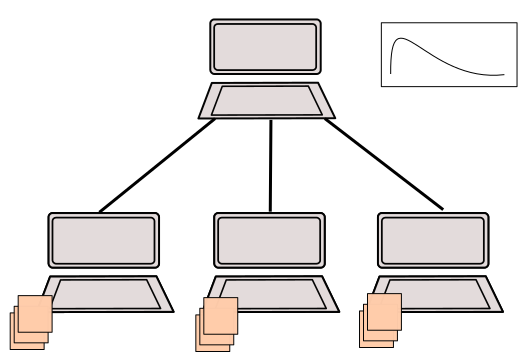
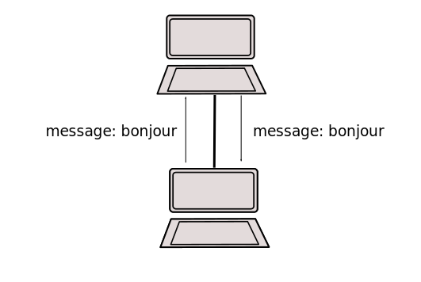
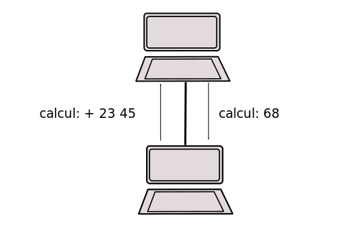

Année: 2023-2024
----------------

### Travaux pratiques 5

## Objectifs

- Comprendre la manipulation des fichiers et répertoires.
- Comprendre la programmation client-serveur.

## Exercice 5.1 [★]


**Liste de fichiers et répertoires dans un dossier**


Le programme `repertoire.c` et `repertoire.h` prend en entrée le nom d'un répertoire via l'interface en ligne de commande et affiche la liste des fichiers (et répertoires, le cas échéant) présents dans ce répertoire. Pour ce faire, il utilise les fonctions `opendir` et `readdir` pour parcourir le répertoire et afficher les noms des fichiers et répertoires.

**Instructions**
- Créez un fichier `repertoire.h` avec la déclaration de la fonction `lire_dossier`.
- Implémentez la fonction `lire_dossier` dans le fichier `repertoire.c`. Cette fonction prend en entrée le nom du répertoire saisi par l'utilisateur.
- Utilisez les fonctions `opendir` et `readdir` pour parcourir le répertoire spécifié.
- Affichez les noms des fichiers et répertoires présents dans le répertoire.

Exemple d'utilisation:
```c
#include "repertoire.h"
#include <stdio.h>

int main(int argc, char *argv[]) {
    if (argc != 2) {
        printf("Utilisation : %s <nom_du_repertoire>\n", argv[0]);
        return 1;
    }

    char *nom_repertoire = argv[1];
    lire_dossier(nom_repertoire);

    return 0;
}
```

Assurez-vous que le programme fonctionne correctement en saisissant le nom d'un répertoire lors de l'exécution et en affichant la liste des fichiers et répertoires dans ce répertoire. Utilisez la fonction `opendir` et `readdir` pour parcourir le répertoire.

## Exercice 5.2 [★]


**Liste récursive de fichiers et répertoires dans un dossier**


Le programme `repertoire.c` et `repertoire.h` prend en entrée le nom d'un répertoire via l'interface en ligne de commande et affiche récursivement la liste des fichiers, répertoires et sous-répertoires présents dans ce répertoire et ses sous-répertoires. Il utilise une fonction récursive pour parcourir tous les niveaux du répertoire.

**Instructions**
- Ajoutez la déclaration de la fonction `lire_dossier_recursif` dans le fichier `repertoire.h`.
- Implémentez la fonction `lire_dossier_recursif` dans le fichier `repertoire.c`. Cette fonction prend en entrée le nom du répertoire saisi par l'utilisateur.
- Utilisez une fonction récursive pour parcourir le répertoire et ses sous-répertoires.
- À chaque niveau de récursion, utilisez les fonctions `opendir` et `readdir` pour parcourir le répertoire en cours.
- Affichez les noms des fichiers, répertoires et sous-répertoires présents dans le répertoire en cours.
- Assurez-vous de gérer correctement la terminaison de la récursion lorsque vous atteignez la fin des sous-répertoires.

Exemple d'utilisation:
```c
#include "repertoire.h"
#include <stdio.h>

int main(int argc, char *argv[]) {
    if (argc != 2) {
        printf("Utilisation : %s <nom_du_repertoire>\n", argv[0]);
        return 1;
    }

    char *nom_repertoire = argv[1];
    lire_dossier_recursif(nom_repertoire);

    return 0;
}
```

Exécutez le programme en saisissant le nom d'un répertoire lors de l'exécution, et il affichera récursivement la liste des fichiers, répertoires et sous-répertoires présents dans ce répertoire et ses sous-répertoires. Utilisez le principe de la fonction récursive pour parcourir tous les niveaux du répertoire.

## Exercice 5.3 [★★]

**Liste itérative de fichiers et répertoires dans un dossier**


Le programme `repertoire.c` et `repertoire.h` prend en entrée le nom d'un répertoire via l'interface en ligne de commande et affiche de manière itérative la liste des fichiers, répertoires et sous-répertoires présents dans ce répertoire et ses sous-répertoires. Cette version utilise une approche itérative (boucle `for` ou `while`) pour parcourir les niveaux du répertoire.

**Instructions**
- Ajoutez la déclaration de la fonction `lire_dossier_iteratif` dans le fichier `repertoire.h`.
- Implémentez la fonction `lire_dossier_iteratif` dans le fichier `repertoire.c`. Cette fonction prend en entrée le nom du répertoire saisi par l'utilisateur.
- Utilisez une approche itérative (boucle `for` ou `while`) pour parcourir le répertoire et ses sous-répertoires.
- À chaque itération de la boucle, utilisez les fonctions `opendir` et `readdir` pour parcourir le répertoire en cours.
- Affichez les noms des fichiers, répertoires et sous-répertoires présents dans le répertoire en cours.
- Assurez-vous que la boucle parcourt tous les niveaux du répertoire de manière itérative.

Exemple d'utilisation:
```c
#include "repertoire.h"
#include <stdio.h>

int main(int argc, char *argv[]) {
    if (argc != 2) {
        printf("Utilisation : %s <nom_du_repertoire>\n", argv[0]);
        return 1;
    }

    char *nom_repertoire = argv[1];
    lire_dossier_iteratif(nom_repertoire);

    return 0;
}
```

Exécutez le programme en saisissant le nom d'un répertoire lors de l'exécution, et il affichera de manière itérative la liste des fichiers, répertoires et sous-répertoires présents dans ce répertoire et ses sous-répertoires en utilisant une approche itérative.

## Exercice 5.4 [★★]

### Client-Serveur



**Simuler un environnement client-serveur en utilisant deux terminaux sur la même machine.**


Le code fourni comprend deux programmes, le serveur (*serveur.c*) et le client (*client.c*), qui permettent de simuler un environnement client-serveur sur la même machine. Le serveur répond aux requêtes du client, ce qui permet de tester la communication entre les deux programmes.

**Instructions**
- Utilisez les fichiers *client.h*, *client.c*, *serveur.h*, *serveur.c*, et *Makefile*.
- Compilez les fichiers en utilisant la commande `make`. Cela générera les fichiers exécutables pour le client (*client*) et le serveur (*serveur*).
- Ouvrez deux terminaux.
- Sur le premier terminal, exécutez le serveur en utilisant la commande `./serveur`.
- Sur le second terminal, exécutez le client en utilisant la commande `./client`.
- Saisissez un message dans le terminal du client, et observez les affichages sur les deux terminaux.
- Modifiez la fonction `recois_envoie_message` dans le fichier *serveur.c*. Actuellement, le serveur renvoie le même message qu'il reçoit. Modifiez le code pour que le serveur demande à l'utilisateur de saisir un message et l'envoie au client.
- Testez votre code en réexécutant le serveur et le client. Assurez-vous que le serveur renvoie le message saisi par l'utilisateur.

Exemple d'utilisation:
```
Terminal 1 (Serveur):
$ ./serveur
Serveur en attente de connexions...
Message reçu: message: Bonjour, le monde!!

^C

Signal Ctrl+C capturé. Sortie du programme.
```

```
Terminal 2 (Client):
$ ./client
Votre message (max 1000 caractères): Bonjour, le monde!!
Message reçu: message: Bonjour, le monde!!
```

En suivant ces instructions, vous pourrez tester la communication entre le client et le serveur sur la même machine.




## Exercice 5.5 [★★★]


**Calcul**

Mettre à jour les fichiers `client.c` et `serveur.c` pour prendre en charge les calculs simples (+, -, \*, ...) entre le client et le serveur en utilisant un nouveau format de message.

**Dans `client.c`** :
1. Ajoutez une nouvelle fonction nommée `envoie_operateur_numeros` qui prendra en charge l'envoi d'opérations de calcul au serveur. Cette fonction devra accepter l'opérateur et un (ou deux) numéros en tant que paramètres.
2. Utilisez cette fonction pour envoyer un message au serveur avec le format approprié. Par exemple, si l'utilisateur entre `calcule : + 23 45`, utilisez `envoie_operateur_numeros` pour envoyer cet opérateur et ces numéros au serveur.

**Dans `serveur.c`** :
1. Ajoutez une nouvelle fonction nommée `recois_numeros_calcule` qui prendra en charge la réception et le calcul des opérations envoyées par le client.
2. Modifiez la boucle principale du serveur pour inclure la réception de messages du client et l'appel à `recois_numeros_calcule` lorsque le message commence par `calcule :`.
3. Implémentez la logique nécessaire pour effectuer les calculs demandés par le client (par exemple, addition, soustraction, multiplication, etc.).
4. Envoyez le résultat au client sous la forme d'un message.

**Exemple d'utilisation** :
1. L'utilisateur entre `calcule : + 23 45` dans le client.
2. Le client utilise `envoie_operateur_numeros` pour envoyer ce message au serveur.
3. Le serveur reçoit le message et utilise `recois_numeros_calcule` pour extraire l'opérateur et les numéros.
4. Le serveur effectue le calcul (dans ce cas, l'addition) et envoie le résultat au client.
5. Le client affiche le résultat, par exemple, `calcule : 68`.

En suivant ces instructions, vous pourrez mettre à jour votre système client-serveur pour prendre en charge les calculs simples entre le client et le serveur en utilisant un nouveau format de message.



## Exercice 5.6 [★★★]

**Calculs complexes**

L'objectif de cet exercice final est de créer un client-serveur qui effectue des calculs sur les notes des étudiants. Le client doit lire les notes des étudiants à partir de fichiers et envoyer des messages au serveur pour effectuer des calculs tels que la somme des notes d'un étudiant et la moyenne de la classe. Le serveur doit être capable de lire et répondre aux messages du client dans une boucle infinie, en effectuant les calculs demandés.

Instructions pour réaliser cet exercice :
- Téléchargez le dossier "etudiant" qui contient les notes de 5 étudiants.

- Assurez-vous que vous avez déjà implémenté la fonction `envoie_operateur_numeros` pour effectuer des calculs côté serveur en utilisant deux nombres à la fois.

- Modifiez le serveur pour qu'il puisse lire et répondre aux messages du client dans une boucle infinie. Le serveur doit attendre les messages du client, effectuer les calculs appropriés en fonction des messages reçus, puis renvoyer les résultats au client.

- Le client doit lire les notes des étudiants à partir des fichiers et envoyer une série de messages au serveur pour effectuer les calculs souhaités. Par exemple, le client peut envoyer des messages tels que :
   - "+ note1 note2" pour demander la somme de deux notes.
   - "+ note3 note4" pour demander la somme de deux notes.
   - "+ somme note5" pour demander la somme.
   - "/ somme 5" pour demander la moyenne des notes de 5 étudiants.

- Le serveur doit être capable de comprendre ces messages, effectuer les calculs demandés, puis renvoyer les résultats au client.

- Assurez-vous que le serveur ne lit pas directement les informations provenant des fichiers des étudiants. Le serveur ne doit effectuer que des calculs arithmétiques simples en fonction des messages du client.

- Testez votre client-serveur en exécutant le serveur dans un terminal et le client dans un autre. Envoyez des messages au serveur pour effectuer différents calculs sur les notes des étudiants.

- Assurez-vous que votre serveur peut gérer plusieurs demandes du client de manière séquentielle dans la boucle infinie.

- Veillez à ce que les résultats renvoyés au client soient corrects et correspondent aux calculs demandés.

En suivant ces instructions, vous pourrez créer un système client-serveur qui effectue des calculs sur les notes des étudiants en utilisant les messages du client pour déclencher les opérations côté serveur.

## Fichiers

*client.c, client.h, Makefile, repertoire.c, repertoire.h, serveur.c,
serveur.h*

## Instructions

- N'oubliez pas les commentaires (nom du fichier, objectif, auteurs, lignes importantes de code, etc.). Les commentaires sont notés.
- N'oubliez pas de mettre à jour le fichier README.md et d'ajouter les détails.
- Compte rendu au format .zip en un seul fichier.
